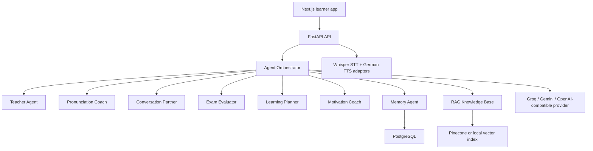

# Architecture

## Agent Contract

Every agent receives:

- Learner memory
- Retrieved curriculum snippets
- Chat mode and task
- Safety and scoring rubric

Every agent returns:

- Answer
- Sources
- Suggested next actions
- Optional score payload

